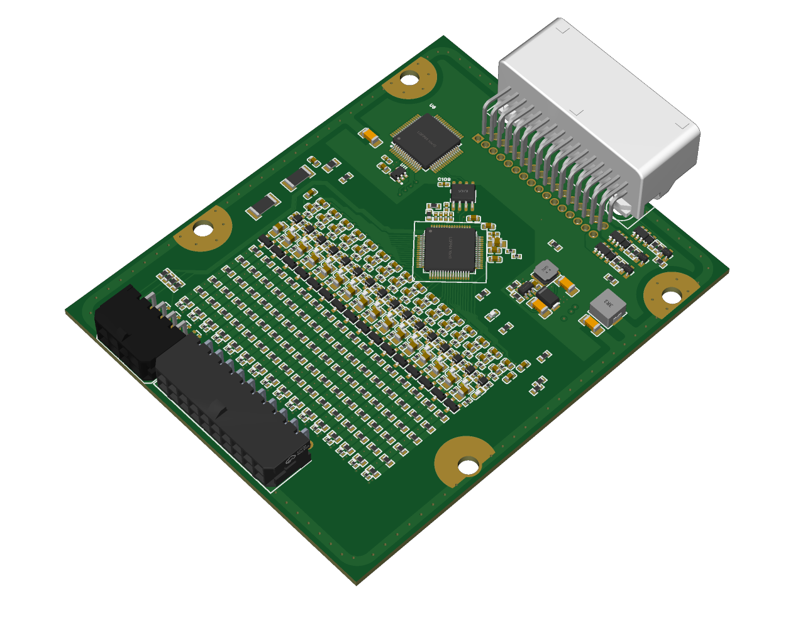

# CPM-4 — Battery Management System (WIP)

  

This is currently a work in progress. Work is underway on the PCB, firmware will follow.
The following is subject to change:

#Description
The CPM4 (Cell Protection Module 4) supports 6 to 16 cells. Incorporates numerous automatic safety features and cell balancing. Set a few solder jumpers, wire it up and get going right away or go advanced with dual canbus interfaces and configuration application. 

#Principle of Operation
The CPM4 will operate in simple or advanced mode. In simple mode, Boards shipped with firmware can be put into service without using a smartphone or computer. 
all state flags are 12v signals which can be connected to the users system. The user can set solder jumpers to define the following:
Cell count
Max capacity(3.0v to 4.2v) or longlife(3.5v to 4.085v) voltage setpoints. (2.8v to 3.6v) (3v to 3.5v) for lifepo4
Cell type, Lithium ion or lifepo4
Master or slave board

In advanced mode, the user will be able to configure the module over canbus and have full control over everything. 

The board has the following output pins:
Precharge
Contactor+
Contactor-
Aux Out 1 (only in advanced mode)
Under Temp
Over Temp
Under Voltage
Balancing
Over Voltage
Charge Allow
Over Current (only in advanced mode)
Battery Cool
Battery Heat

The board has the following Input Pins
Charge Request
Fault In
Crash
Current Sensor (Only in advanced mode)
Aux In 1 (only in advanced mode)
HV Present

Two pins will be for the high voltage interlock loop if building a high voltage system with multiple boards. 

- Follow progress via **Issues** and **Discussions** in this repo.
- Licensing (intended): **Hardware** — CERN-OHL-W v2 • **Firmware** — Apache-2.0 • **Docs** — CC BY 4.0  
- **Safety:** High voltage is dangerous. For competent developers.

